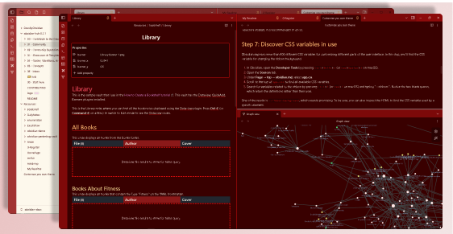
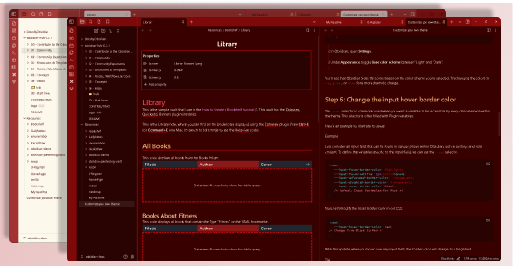

# Evil Red theme for Obsidian

A red dark theme for Obsidian, compatible to Obsidian V1.4.13 and above.

## Install

The theme is yet to be published on Obsidian Marketplace. For now you can manually install it from my release on github :

1. Download the zip file from the [release](https://github.com/tu2-atmanand/EvilRed-ObsidianTheme/releases).

2. Go to the location ``.obsidian/themes`` in the root folder of your vault.

3. Create a new folder named `EvilRed`.

4. Extract the content of the zip file you downloaded from the release.

5. Go in the Setting>Appearance in your vault and select the EvilRed from the drop-down for Thmes.

6. Enjoy!

> If required you will need to restart your obsidian.

## Creator

This theme is created and maintained by [Atmanand Gauns](https://github.com/tu2-atmanand).

[License]()
